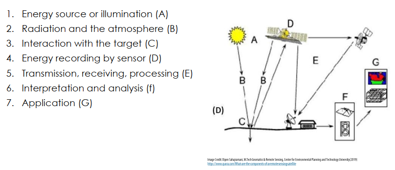

# ▶ Быстрый старт

## Дистанционное зондирование

Под дистанционным зондированием _(Remote Sensing)_ понимают получение информации об объектах без непосредственного контакта с ним. Наблюдение в бинокль, фотография на смартфон, измерения расстояния дальномером — это все примеры дистанционного зондирования. В данном пособии мы сосредоточимся на работе с данными дистанционного зондирования Земли из космоса (ДЗЗ).

ДЗЗ применяется для:

* определения границ естественных и антропогенных объектов;
* определения количественных и качественных свойств объектов, их классификация;
* мониторинга изменений;
* выявления угроз.

Например, в лесном хозяйстве ДЗЗ позволяет: картировать леса и отдельные лесные участки, оценивать их свойства, выявлять закономерности в развитии лесных экосистем, наблюдать за динамикой их развития и лесопользованием, оценивать риски и выявлять лесные пожары, ветровалы, лесопатологии.

ИЛЛЮСТРАЦИЯ ВЫРУБОК

ИЛЛЮСТРАЦИЯ ВЕТРОВАЛА

### Основы спутниковых наблюдений

