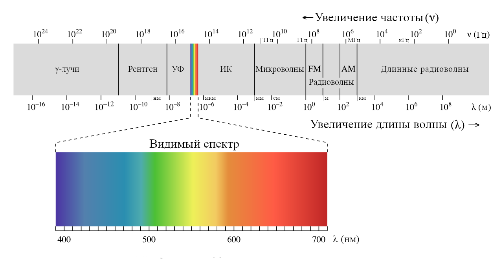

# ▶ Быстрый старт

## Дистанционное зондирование

Под дистанционным зондированием _(Remote Sensing)_ понимают получение информации об объектах без непосредственного контакта с ним. Наблюдение в бинокль, фотография на смартфон, измерения расстояния дальномером — это все примеры дистанционного зондирования. В данном пособии мы сосредоточимся на работе с данными дистанционного зондирования Земли из космоса (ДЗЗ).

ДЗЗ применяется для:

* определения границ естественных и антропогенных объектов;
* определения количественных и качественных свойств объектов, их классификация;
* мониторинга изменений;
* выявления угроз.

Например, в лесном хозяйстве ДЗЗ позволяет: картировать леса и отдельные лесные участки, оценивать их свойства, выявлять закономерности в развитии лесных экосистем, наблюдать за динамикой их развития и лесопользованием, оценивать риски и выявлять лесные пожары, ветровалы, лесопатологии.

ИЛЛЮСТРАЦИЯ ВЫРУБОК

ИЛЛЮСТРАЦИЯ ВЕТРОВАЛА

### Основы спутниковых наблюдений



### Начало работы с _Google Earth Engine_

Наиболее простым способом ознакомиться с возможностями _GEE_ является интерактивный [редактор кода](https://code.earthengine.google.com/). Его интерфейс разделен на три блока: блок поиска, блок редактора и блок карты. Строка поиска в верхнем блоке позволяет проводить поиск по базе адресов и местоположений _Google_ и по каталогу данных _Earth Engine_. Также в верхнем блоке представлены кнопки выпадающих меню: справки, обратной связи, управления аккаунтом. Средний блок разделен на три панели. Левая панель содержит три вкладки: доступные скрипты (навигатор), справка по функциям _JS API GEE_ и ассеты. В центральной панели находится непосредственно редактор кода _JavaScript_. Над редактором кода расположены кнопки:

* _“**Get Link**”_ генерирует уникальный _URL_–адрес скрипта.
* _“**Save**”_ позволяет сохранить внесенные изменения (также можно сохранить изменения при помощи сочетания клавиш `Ctrl + S`).
* _“**Run**”_ отправляет активный скрипт на сервер _Earth Engine_ для расчета (сочетание клавиш – `Ctrl + R`).
* _“**Reset**”_ сбрасывает редактор кода к исходному состоянию.
* _“**Apps**”_ выводит модальное окно менеджера приложений _Earth Engine_
* кнопка с шестеренкой открывает выпадающее меню опций редактора.

Правая панель содержит вкладки инспектора, консоли для вывода непространственных результатов расчета, и списка задач. Нижний блок с картой служит для визуализации пространственных результатов расчета (тематических слоев). Он также содержит кнопки интерактивного рисования и менеджера слоев.

### Открытие и запуск скриптов

1. Откройте редактор кода по ссылке: [code.earthengine.google.com](https://code.earthengine.google.com/). В случае, если вы еще не зарегистрировались в системе, вам будет предложено пройти регистрацию.
2. Перейдите на вкладку _“**Scripts**”_ левой панели среднего блока. Найдите в навигаторе скрипт _Examples / Image / NormalizedDifference_.
3. Нажмите кнопку _“**Run**”_ над центральной панелью, чтобы выполнить скрипт. В результате выполнения в блоке карты появятся два слоя: снимок _MODIS_ в псевдонатуральных цветах и индексное изображение _NDVI_. В данном примере можно познакомиться с такими методами, как `normalizedDifference()`, `Map.setCenter()`, `select()`.

#### Типы данных _Earth Engine_

Двумя основными типами пространственных данных в _Earth Engine_ являются `Image` и `Feature`, соответствующие растровым и векторным данным. Растры представлены совокупностью каналов и метаданными, векторные данные – совокупностью геометрии и семантики. Наборы растровых данных (например, совокупность изображений космоснимков, полученных в разное время) представлены типом `ImageCollection`. Наборы векторных данных представлены `FeatureCollection`.


#### Другие типы данных _GEE_

Также в _Earth Engine_ используются такие типы данных, как `Number`, `String`, `Date`, `List`, `Dictionary`, `Array`. Они будут рассмотрены позднее. Обратите внимание, что все перечисленные типы данных обрабатываются на стороне сервера.


#### Алгоритмы _Earth Engine_

Существует несколько способов запуска операций посредством _API_:

* Вызов методов, прикрепленных к объектам.
* Вызов алгоритмов непосредственно.
* Вызов специфических функций редактора кода.
* Определение и вызов пользовательских функций.

Примером вызова метода, прикрепленного к объекту, может быть вызов метода `add()` типа данных `Image`:

```javascript
var result = image1.add(image2);
```

Данный метод добавляет каналы `image1` к каналам `image2`.
